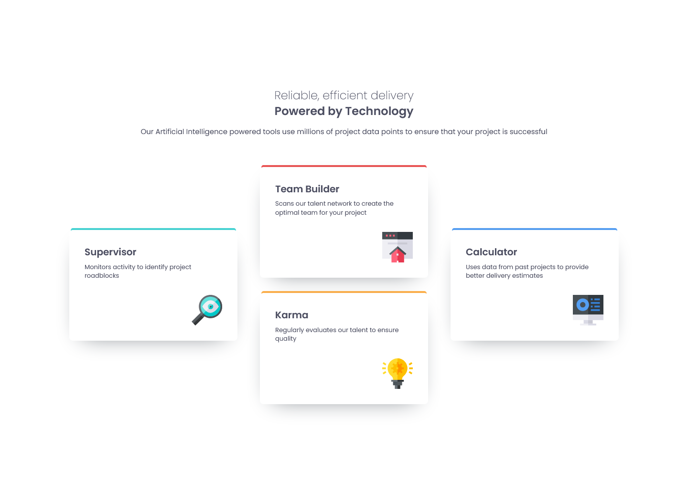
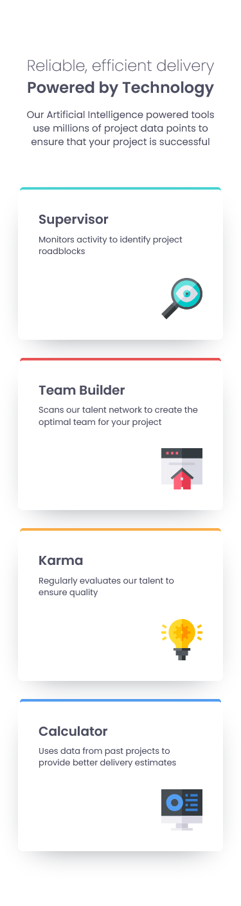

# Frontend Mentor - Four card feature section solution

This is a solution to the [Four card feature section challenge on Frontend Mentor](https://www.frontendmentor.io/challenges/four-card-feature-section-weK1eFYK). Frontend Mentor challenges help you improve your coding skills by building realistic projects. 

## Table of contents

- [Overview](#overview)
  - [The challenge](#the-challenge)
  - [Screenshot](#screenshot)
  - [Links](#links)
- [My process](#my-process)
  - [Built with](#built-with)
  - [What I learned](#what-i-learned)
  - [Continued development](#continued-development)
  - [Useful resources](#useful-resources)
- [Author](#author)

## Overview

### Screenshot

### Links

- Solution URL: (https://github.com/dansuda/four-card-feature-section-master)
- Live Site URL: (https://dansuda.github.io/four-card-feature-section-master)

## My process

### Built with

- Semantic HTML5 markup
- CSS custom properties
- CSS Flexbox
- CSS Grid
- SASS/SCSS [https://sass-lang.com/]
- Mobile first workflow

### What I learned

I learned about grid in more depth than I had the first time, being exposed to concepts like `grid-area` and `grid-template-areas`, and through learning about shortened properties, I also learnt about `flex-flow` being a contraction of `flex-direction` and `flex-wrap`.

### Continued development

My growth in html and css is reaching the point where I can do 90% of projects comfortably except for parts I've never learned before. Huge progress!

### Useful resources

- (https://www.w3schools.com) - This helped me to understand how to use various css rules and how important they are. 
- (https://www.stackoverflow.com) - This is an amazing website which has really old questions but are still relevant to people like me today who seem to have joined this bandwagon very late. It's nice and helpful they've been around for so long.

## Author

- Github - [dansuda](https://www.github.com/dansuda)
- Frontend Mentor - [@dansuda](https://www.frontendmentor.io/profile/dansuda)